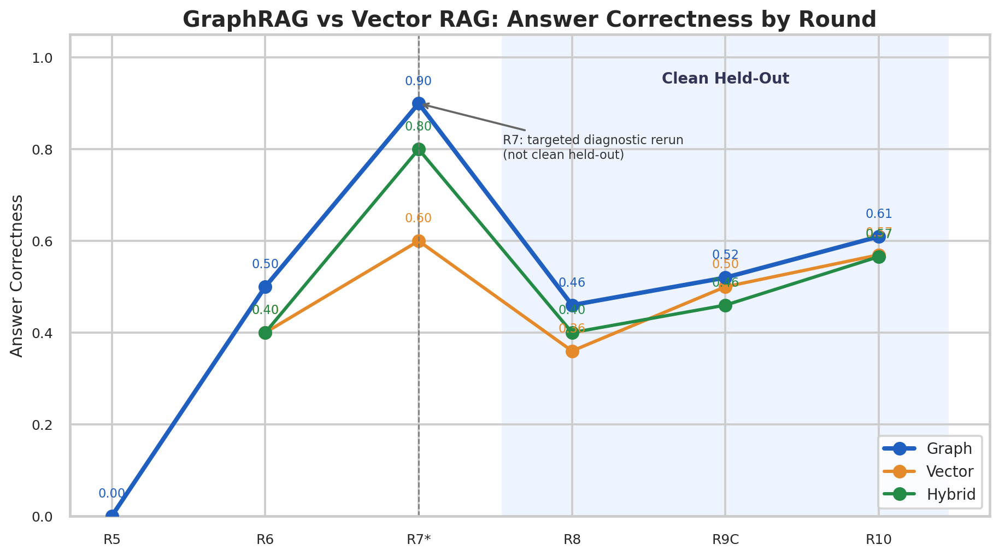
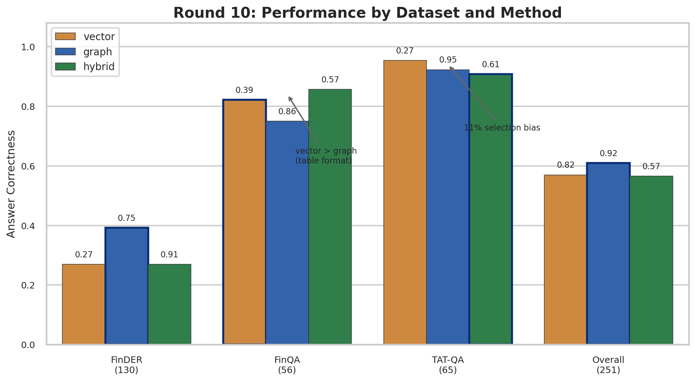
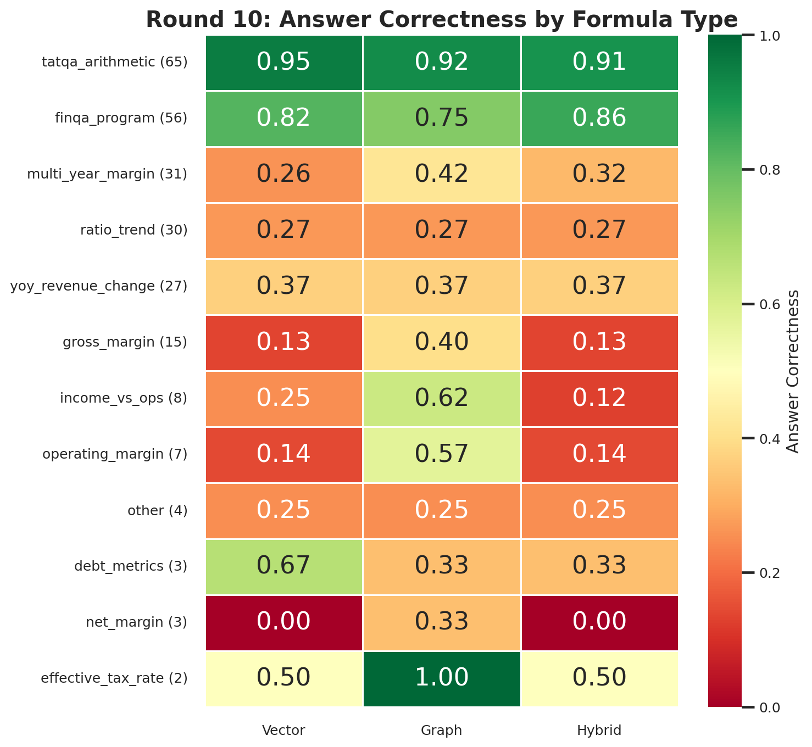
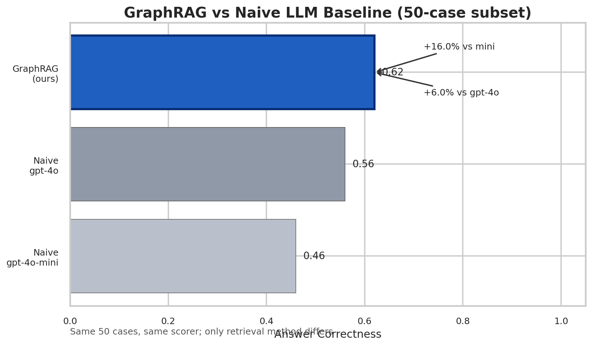

# FinancialGraphRAG: Knowledge Graph-Enhanced Retrieval for Financial QA

A rigorous evaluation of **GraphRAG vs. VectorRAG** on financial numerical reasoning tasks, built on S&P 500 10-K filings across three benchmark datasets.

---

## Key Results

### GraphRAG outperforms naive GPT-4o with a cheaper model

| Method | Model | Answer Correctness | vs. GraphRAG |
|---|---|---:|---|
| **GraphRAG (ours)** | gpt-4o-mini | **0.62** | — |
| Naive full-text | gpt-4o | 0.56 | −0.06 |
| Naive full-text | gpt-4o-mini | 0.46 | −0.16 |

> *Same 50 cases, same scorer. GraphRAG uses KG-based fact retrieval + structured prompting. Naive provides only the raw document text.*

### Consistent graph > vector across 3 independent clean held-out benchmarks

| Round | n cases | Graph AC | Vector AC | Graph − Vector |
|---|---:|---:|---:|---:|
| Round 8 | 50 | 0.46 | 0.36 | +0.10 |
| Round 9C | 50 | 0.52 | 0.50 | +0.02 |
| **Round 10** | **251** | **0.61** | **0.57** | **+0.04** |

### Performance by dataset (Round 10, graph method)

| Dataset | Graph AC | Vector AC | Notes |
|---|---:|---:|---|
| FinDER (text-based QA) | **0.39** | 0.27 | KG clearly helps on unstructured text |
| FinQA (table-based QA) | 0.75 | 0.82 | Structured tables → vector sufficient |
| TAT-QA (arithmetic QA) | **0.92** | 0.95 | High across all methods |

---

## What This Project Is

**FinancialGraphRAG** is an end-to-end pipeline that:

1. **Extracts structured knowledge** from 10-K financial filings into a Neo4j knowledge graph
2. **Answers numerical financial questions** by retrieving relevant KG facts + applying structured prompting
3. **Evaluates rigorously** with a clean held-out evaluation framework across FinDER, FinQA, and TAT-QA

The central question: *Does representing financial data as a knowledge graph improve numerical reasoning accuracy over vector retrieval alone?*

---

## System Architecture

```
                        Financial 10-K Filing
                               │
                    ┌──────────▼──────────┐
                    │  Step B KG Extractor │  (gpt-4o-mini, targeted IE)
                    └──────────┬──────────┘
                               │ structured facts
                    ┌──────────▼──────────┐
                    │   Neo4j / DozerDB    │  LLMObservation nodes
                    │  Knowledge Graph     │  per (ticker, metric, year)
                    └──────────┬──────────┘
                               │
          ┌────────────────────┼────────────────────┐
          │                    │                    │
   ┌──────▼──────┐    ┌────────▼───────┐    ┌──────▼──────┐
   │ vector_only │    │  graph_neo4j   │    │   hybrid    │
   │ (text RAG)  │    │  (KG retrieval)│    │ (text + KG) │
   └──────┬──────┘    └────────┬───────┘    └──────┬──────┘
          └────────────────────┼────────────────────┘
                               │
                    ┌──────────▼──────────┐
                    │  Structured Prompt   │  v3.4: formula hints,
                    │  + gpt-4o-mini       │  YoY steps, rounding rules
                    └──────────┬──────────┘
                               │
                    ┌──────────▼──────────┐
                    │    Scorer v9         │  answer_correctness (binary)
                    │                      │  numerical_closeness (0-1)
                    └─────────────────────┘
```

---

## Datasets

| Dataset | Type | Cases used | Source |
|---|---|---:|---|
| [FinDER](https://github.com/) | Text-based financial QA (10-K passages) | 286 | S&P 500 annual reports |
| [FinQA](https://github.com/czyssrs/FinQA) | Table + arithmetic program QA | 132 | SEC 10-K/10-Q filings |
| [TAT-QA](https://github.com/NExTplusplus/TAT-QA) | Hybrid table+text arithmetic QA | 65 | Financial reports |
| **Total** | | **483** | across Rounds 8, 9C, 10 |

All evaluation cases are **clean held-out** — selected after the system was designed, never seen during development.

---

## Evaluation Methodology

This project treats evaluation with the same rigor as the system itself.

### Claim boundaries
Every result is tagged with a `claim_boundary` string that precisely describes what the result can and cannot be generalized to. This prevents over-claiming from small samples.

### Delta attribution
When multiple changes are made between rounds, their effects are separated:
- **No-model rescoring** (apply scorer fix to existing traces without re-running the model)
- **Separate KG patch validation** (snapshot → patch → rollback ready)
- **Prompt ablation** vs. KG ablation vs. scorer fix — each isolated

### Anti-cherry-picking
All cases are selected by **deterministic quality scoring** before observing model outcomes. Case selection scripts use hash-based tiebreakers.

### Clean held-out splits
Rounds 8, 9C, and 10 use cases from **different companies** (tickers never seen in prior rounds). No test case is reused across rounds.

---

## Key Findings

**1. KG retrieval helps for text-based financial QA, but not for table-based QA**

On FinDER (text passages), graph consistently outperforms vector by 10–20 percentage points. On FinQA (structured tables), vector retrieval matches or exceeds graph — the table structure already makes relevant numbers easy to find.

**2. Structured prompting + KG beats a more powerful model without structure**

GraphRAG with `gpt-4o-mini` (AC=0.62) outperforms naive `gpt-4o` (AC=0.56) on the same 50-case subset, using the same scorer. The structured prompt engineering and KG retrieval add more value than a model upgrade alone.

**3. Hybrid retrieval (text + KG) underperforms graph-only on FinDER**

In 29 out of 130 FinDER cases, providing text context *alongside* KG facts caused the model to produce wrong answers that graph-only got right. This suggests text introduces numerical noise that KG retrieval avoids.

**4. Iterative prompt engineering has measurable, attributable effects**

Example: Adding explicit YoY calculation steps to the prompt improved `yoy_revenue_change` formula accuracy from **0.20 → 0.37** (+0.17 AC), verified by comparing the same scorer on new cases.

---

## Experiment History

| Round | Description | Graph AC | Vector AC |
|---|---|---:|---:|
| Round 5 | Baseline (existing KG) | 0.00 | — |
| Round 6 | Targeted KG extraction (Step B) | 0.50 | 0.40 |
| Round 7† | Prompt v3.3 + scorer fix + KG patch | 0.90 | 0.60 |
| **Round 8** | First clean held-out (50 cases) | **0.46** | 0.36 |
| Round 9C | Pipeline fixes + scorer v9 | 0.52 | 0.50 |
| **Round 10** | 251 cases, 3 datasets | **0.61** | 0.57 |

*† Round 7 is a targeted diagnostic rerun of 5 known failures — not a clean held-out benchmark.*

---

## Visualizations

| Chart | Description |
|---|---|
|  | Answer correctness trend across rounds |
|  | Graph vs. vector vs. hybrid by dataset |
|  | Performance by financial formula type |
|  | GraphRAG vs. naive GPT baseline |

---

## Repository Structure

```
scripts/
  round10_finder_case_selector.py   # Case selection pipeline
  round10_formula_contract_gen.py   # Auto-generate scorer contracts (GPT)
  round10_step_b_kg_extraction.py   # Targeted KG extraction → Neo4j
  round10_eval.py                   # Three-method evaluation loop
  scorer_v9.py                      # Scorer with tolerance calibration
  ticker_filter.py                  # Ticker validation & denylist
  naive_baseline_eval.py            # Naive GPT baseline comparison
  generate_portfolio_visuals.py     # Visualization generation

outputs/
  round10_eval/state.json           # Round 10 final results
  naive_baseline/comparison_summary.md
  portfolio/                        # PNG visualizations
```

---

## Limitations & Honest Scope

- **Sample size**: 251 cases is sufficient for directional claims, not for strong statistical guarantees. The graph > vector margin (+0.04) is small at this scale.
- **TAT-QA selection bias**: Only 11% of TAT-QA questions had extractable tickers. Results (0.92 AC) may not generalize to the full dataset.
- **FinQA pattern**: Vector retrieval consistently matches or beats graph on table-based QA. GraphRAG's advantage is specific to text-heavy financial documents.
- **Model**: All evaluations use `gpt-4o-mini`. Upgrading to `gpt-4o` would likely improve all methods; the relative advantage of graph retrieval may differ.

---

## Tech Stack

- **LLM**: OpenAI `gpt-4o-mini` (eval + contract generation), `gpt-4o` (naive baseline)
- **Graph DB**: Neo4j / DozerDB
- **Embedding**: `text-embedding-3-small` (Step A semantic retrieval)
- **Evaluation**: Custom scorer with `answer_correctness`, `numerical_closeness`, `required_fact_recall`
- **Datasets**: FinDER, FinQA, TAT-QA
