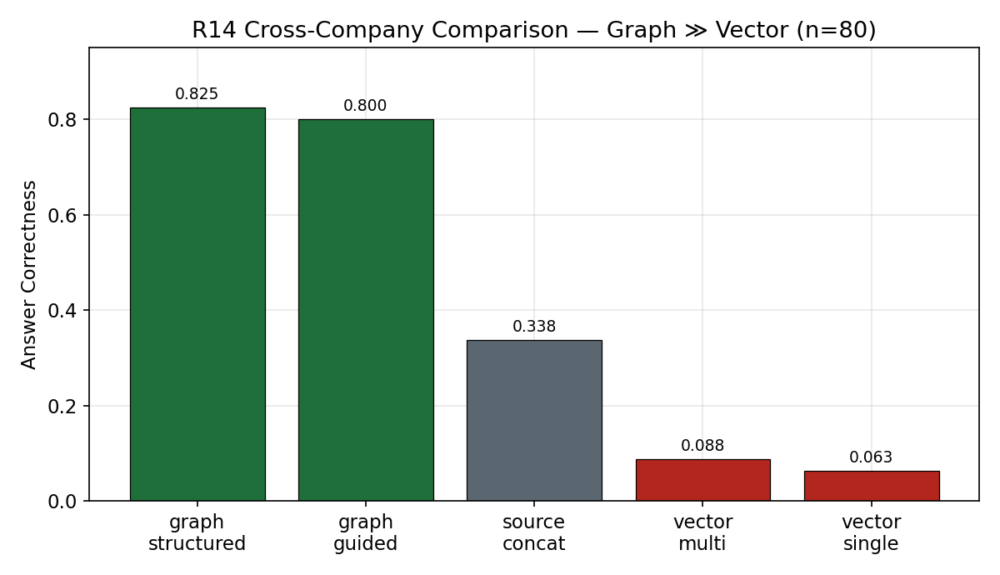
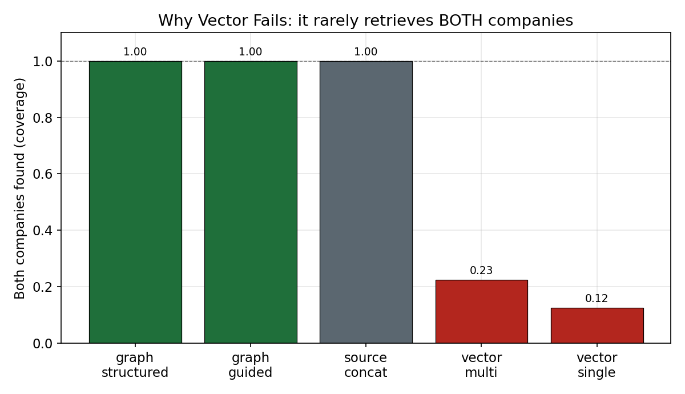
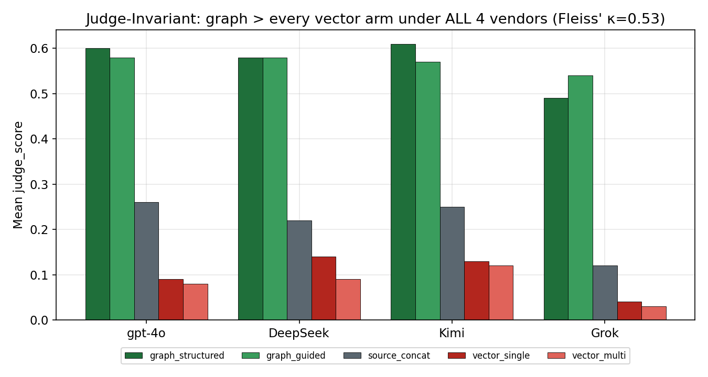

# FinancialGraphRAG — When Does a Knowledge Graph Actually Help Financial QA?

A controlled **GraphRAG vs. VectorRAG** evaluation on financial numerical reasoning (S&P 500 10-K
filings, three public benchmarks + a synthetic cross-company suite). This project does three things
most RAG comparisons don't:

1. **It caught and corrected its own scoring bug.** An earlier version reported *graph > vector*. That
   was traced to a scorer-contract defect and **reversed** after the fix. The old numbers are kept on
   purpose, marked superseded.
2. **It caught and corrected its own retrieval-provenance mislabel.** A later audit found that the
   single-company "vector" arms were not retrieval at all — they fed the model the case's *own*
   evidence text. They were relabeled `case_text_*`. The only real corpus retriever in the repo is the
   cross-company arm.
3. **It isolated the one setting where graph retrieval wins by a large margin** — cross-company
   structured comparison — and then **stress-tested that win** with a fair chunk-level retriever and a
   **four-vendor LLM judge panel**. The win survived.

---

## TL;DR — Claim Boundary (read this first)

GraphRAG is **not** uniformly better than vector retrieval on financial QA. Where it lands depends
entirely on the query type:

| Setting | Winner | Evidence |
|---|---|---|
| Single-company text QA (FinDER) | **text/case-text ≥ graph** | R10 v2, R12, R13 |
| Single-period single-metric (operating/net margin) | **graph ≈ vector** | R13 (semantic KG) |
| Multi-year / trend | **vector > graph** (both weak) | R10 v2, R13, R14-L3 |
| **Cross-company structured comparison** | **graph ≫ vector** | **R14, confirmed in R15** |

> ⚠️ **Two self-corrections, kept visible on purpose.**
> (1) Early "graph > vector" headlines (R8/R9C/R10; "cheaper model + KG beats GPT-4o") came from a
> **buggy scorer contract** and are **superseded** — see [What Went Wrong](#what-went-wrong-and-how-we-caught-it).
> (2) The single-company **"vector" arms were case-text, not retrieval** — see
> [R15 Provenance](#r15--we-stress-tested-our-own-win). We treat single-company "vector" numbers as
> *text baselines*; the only validated corpus-retrieval-vs-graph comparison is R14/R15.

---

## Results at a Glance


*The result — cross-company comparison (n=80): structured graph **0.825** vs vector **0.06–0.09**.*


*The mechanism — vector rarely retrieves **both** companies (0.13–0.23); the graph anchors all entities (1.00).*


*Not one biased judge — four LLMs (incl. three cross-vendor) all rank graph > every vector arm (Fleiss' κ = 0.53).*

Regenerate: `python scripts/round15_portfolio_visuals.py` (numbers hardcoded from the pinned canonical set).

---

## Headline — Graph Dominates Cross-Company Structural Queries (R14)

When the question requires anchoring **multiple companies** and traversing to comparable metric-year
cells, structured graph retrieval beats every text/vector baseline by a wide margin.

| Method | n | Answer Correctness | Numerical Closeness | Both companies found | Avg tokens |
|---|---:|---:|---:|---:|---:|
| **graph_structured** | 80 | **0.825** | **0.965** | **1.00** | **2,357** |
| graph_guided_text | 80 | 0.800 | 0.968 | 1.00 | 3,594 |
| source_text_concat | 80 | 0.338 | 0.862 | 1.00 | 3,549 |
| vector_multi_by_company | 80 | 0.088 | 0.687 | 0.225 | 6,436 |
| vector_single | 80 | 0.063 | 0.689 | 0.125 | 5,745 |

*(Token column = total tokens, R14 doc-level run. The sharper "¼ tokens" prompt-token comparison is in
the R15 section below, where graph 1.7k vs fair-vector 6.5k prompt tokens.)*

**Why vector fails here:** among failed `vector_single` cases, **93.3%** are missing-company retrieval
failures — vector retrieves chunks for one company and never surfaces the other. The graph anchors every
company equally and traverses, so retrieval coverage is **1.00**. And graph does it on **~⅓ the tokens**
(2.4k vs 5.7–6.4k total; ¼ on prompt tokens — see R15) — it is *more accurate and more token-efficient*.

**Coverage is not the whole story.** `source_text_concat` is *given* both companies' full text
(both-found 1.00) yet scores only 0.338 — the model drowns in a wall of text. So graph's edge is not
"having both companies," it is **distractor-free targeting**.

**By query level** (graph_structured): direct lookup (L1) **0.925**, derived/ratio (L2) **0.867**,
multi-year trend (L3) **0.300**. Trend is the hard case even for graph.

**Coverage audit (read-only Neo4j verification — PASS):** 323 company anchors · 34 canonical metrics ·
5,640 observations · 5,246 unique `(ticker, metric, year)` triples · **0 written-but-not-reachable** ·
131 comparable metric-year cells · 80/80 cases route to the `structural_graph` bucket. The graph
advantage is claimed **only inside this structural bucket**, which equals the full eval population here.

*Scope: 80 synthetic cross-company cases over the semantic KG. See [Limitations](#limitations--honest-scope).*

---

## R15 — We Stress-Tested Our Own Win (Provenance + Fair Vector + Multi-Judge)

A skeptic's three objections to the R14 headline — *"your vector was fake / weak / your judge is
biased"* — are exactly what R15 set out to kill.

### 1. Provenance audit — every "vector" arm classified by *implementation*
The audit reclassified all historical arms: **13 of the `vector_only_*` arms (R3–R10) were
`per_case_evidence_only`** (the case's own evidence text, no corpus/embedding/retrieval) → relabeled
`case_text_only_*`. The benchmark-scale `vector_only_scaled` (R14B) was **gold context** → relabeled
`gold_text_only`. **Only R14 used a real retriever.** Originals were frozen and relabeled by sidecar,
never deleted. *Consequence:* the single-company "vector ≥ graph" result is honestly *"case-text ≥
graph,"* not a retrieval comparison.

### 2. Fair retriever — the R14 vector was real but weak; we rebuilt it
R14's vector arms were genuine retrievers but **document-level** (whole-filing passages) and
**in-memory**. R15 built a **chunk-level, persistent, provenance-logged** index (1,200-char chunks,
`text-embedding-3-small`, on-disk; every retrieval logs `chunk_id`/`source_case_id`/score). Re-running
R14's vector arms on it:

| | R14 (doc-level) | R15 (fair chunk) |
|---|---:|---:|
| vector_single AC | 0.063 | **0.163** |
| vector_single both-found | 0.125 | **0.46** |
| graph_structured AC | 0.825 | 0.825 |
| **head-to-head margin** | 0.7375 | **0.7125** |

Chunking **tripled** vector's coverage and AC — yet graph still wins ~5× on AC. The margin barely
moved. The bottleneck is **structural**: similarity search cannot assemble a two-company comparison
context even with chunking, query decomposition, and 4× the token budget (both-found stays < 0.46).

### 3. Four-vendor judge panel — the ranking is judge-invariant
All five arms were re-judged by **gpt-4o, DeepSeek-v4-pro, Kimi (Moonshot), and Grok-4.3** under one
fixed prompt (1,598 valid judgments, $4.80, 0 generation calls).

| Arm (mean judge_score) | gpt-4o | DeepSeek | Kimi | Grok |
|---|---:|---:|---:|---:|
| graph_structured | 0.60 | 0.58 | 0.61 | 0.49 |
| graph_guided_text | 0.58 | 0.58 | 0.57 | 0.54 |
| source_text_concat | 0.26 | 0.22 | 0.25 | 0.12 |
| vector_single_chunk | 0.09 | 0.14 | 0.13 | 0.04 |
| vector_multi_chunk | 0.08 | 0.09 | 0.12 | 0.03 |

**Graph beats every vector arm under all four judges — the ranking is judge-invariant.** Inter-judge
agreement is Fleiss' κ = 0.53 (moderate); critically the disagreement is on the *partial*-vs-correct
boundary (Grok scores nearly binary; gpt-4o uses *partial* heavily), **not** on the graph-vs-vector
ordering, whose ≥0.35 margin dwarfs the inter-judge noise. **The claim rests on ranking agreement
(unanimous), which κ — a per-item metric — understates.**

*Honesty notes: the generator is gpt-4o-mini, so gpt-4o shares its vendor — hence the three cross-vendor
judges; the ranking holds under all four. Kimi `kimi-k2.6` failed strict-JSON formatting and fell back
to `moonshot-v1-128k`.*

**Bottom line:** *R14's vector baseline was weak, but after correcting with a chunk-level persistent
retriever and confirming with a four-vendor judge, the cross-company graph advantage persists — and
graph achieves it with ¼ the tokens of vector.*

---

## Single-Company Results, Corrected (Round 10 v2)

After fixing the scorer contract, the single-company picture **reverses** from the original report:
text is the stronger general method, hybrid is close, graph trails.

| Method | Overall AC (v2) | Overall NC (v2) | AC (orig, superseded) |
|---|---:|---:|---:|
| case_text_only *(labeled "vector" pre-R15)* | **0.673** | 0.832 | 0.570 |
| hybrid_neo4j | 0.638 | 0.851 | 0.566 |
| graph_neo4j | 0.498 | 0.743 | 0.610 |

| Dataset | graph | case_text | hybrid | Note |
|---|---:|---:|---:|---|
| FinDER (text QA) | 0.177 | **0.469** | 0.408 | Biggest reversal — text clearly ahead |
| FinQA (table QA) | 0.750 | 0.821 | **0.857** | Structured tables → text/hybrid sufficient |
| TAT-QA (arithmetic) | 0.923 | **0.954** | 0.908 | High across all methods |

> **Label note (R15 audit):** the column shown as `case_text_only` was logged as `vector_only` but is
> `per_case_evidence_only` — the case's own evidence text, not corpus retrieval. Numbers are unchanged;
> only the label is corrected. So this section says *"the source text beats graph facts for
> single-company QA"* — it is **not** a vector-retrieval claim.

---

## What Went Wrong (and How We Caught It)

This is the part to actually read.

**1. The year-bug scorer contract.** FinDER `expected_values` were populated with the fiscal **year**
instead of the metric value. Graph answers echoing a year scored as correct via false positives,
inflating graph AC. After correcting contracts (**v2**) and re-scoring 390 FinDER traces with no model
re-runs: overall graph 0.610 → **0.498**, vector 0.570 → **0.673** (reversed); FinDER graph 0.392 →
**0.177** (complete reversal).

**2. The naive-baseline headline was the same artifact.** "GraphRAG (mini) 0.62 > naive GPT-4o 0.56"
relied on the buggy contract. Under v2: graph **0.52**, naive gpt-4o **0.64**, naive mini **0.54** —
retracted.

**3. Stacking KG facts on text doesn't help (R12).** `graph_kgsrc` (0.344) did not beat `source_text_only`
(0.409) over 186 cases — both trailed the text baseline (0.575). Text is what matters in single-company QA.

**4. A real KG helps, but not enough for general FinDER (R13).** Semantic-IE rebuild lifted graph
0.177 → **0.215**, still below text (0.30). Exception: single-period single-metric reaches parity —
operating_margin **0.714 = 0.714**, net_margin **0.667 = 0.667**.

**5. Bigger model ≠ automatic fix (R11).** gpt-4o-mini → gpt-4o on the graph pipeline *lowered* overall
AC (0.48 → 0.44); it only helped FinQA and removed mini's empty answers.

**6. Our own "vector" was not retrieval (R15).** The single-company "vector" arms were case-text; only
R14 was a real retriever. Caught by an implementation audit, fixed by building a fair chunk retriever
and re-confirming the one real comparison (R14). See [R15](#r15--we-stress-tested-our-own-win).

These are why the project moved from *"is graph better?"* to *"where is graph better?"* — which R14
answers and R15 hardens.

---

## Hypotheses — What Held and What Didn't

| ID | Hypothesis | Verdict | Evidence |
|---|---|---|---|
| H1 | graph_structured > weak vector (single query) | ✅ PASS | 0.825 vs 0.062 AC; all 4 judges |
| H2 | graph_structured ≥ strong vector (per-company decomposition) | ✅ PASS | 0.825 vs 0.087; vs fair chunk 0.113 |
| H3 | graph_guided_text ≥ graph_structured | 🟡 MIXED | ~tied (0.800 vs 0.825); judge-dependent |
| H4 | graph retrieves *both* companies more than vector | ✅ PASS | both-found 1.00 vs 0.13–0.46 |
| H5 | vector failure = single-company *coverage* gap, not reasoning | ✅ PASS | 93.3% of failed vector_single |
| H6 | graph≫vector ranking is judge-invariant | ✅ PASS | unanimous across 4 vendors (Fleiss' κ 0.53) |
| H7 | graph win is not a context-budget artifact | ✅ PASS | graph wins on ¼ the tokens |
| L3 | graph handles multi-year **trend** | 🔴 FAIL | graph L3 = 0.30 (vector 0.00) |
| SC | single-company: graph ≥ text | 🔴 FAIL | text ≥ graph (FinDER 0.47 vs 0.18) |

We report the two FAILs as first-class results, not footnotes.

---

## Experiment History

| Round | Description | Status | Headline |
|---|---|---|---|
| R4–R7 | Shadow overlay → real LLM-IE KG; contract/overload diagnostics | infra/diagnostic | — |
| R8 | First clean held-out (50) | **pre-v2 contract** | graph 0.46 / vector 0.36 ‡ |
| R9C | Pipeline fixes + scorer v9 | **pre-v2 contract** | graph 0.52 / vector 0.50 ‡ |
| R10 (orig) | 251 cases, 3 datasets | **SUPERSEDED** | graph 0.61 / vector 0.57 |
| **R10 v2** | Year-bug fixed, 390 re-scored | **corrected** | **text 0.673 > graph 0.498** |
| R11 | gpt-4o vs mini ablation (v2) | ablation | graph 4o 0.44 / mini 0.48 |
| R12 | KG-facts-on-text vs text-only (186) | control | text 0.409 > kgsrc 0.344 |
| R13 | FinDER semantic KG re-extraction (130) | rebuild | graph 0.215 < text 0.30; single-metric parity |
| **R14** | Cross-company semantic KG, 80 synthetic | **headline** | **graph 0.825 vs vector 0.063/0.088** |
| R14B | FinQA fact-presentation ablation at scale (400) | scale | structured +0.10 over gold text |
| **R15** | Provenance audit + fair chunk retriever + 4-vendor judge | **hardening** | **graph win survives; judge-invariant** |

‡ R8/R9C used the pre-v2 FinDER contract; treat their FinDER component as directional — R10 v2 is the
corrected single-company reference.

---

## Architecture

```
                 Financial 10-K Filing
                         │
              ┌──────────▼──────────┐
              │  LLM-IE Extractor    │  (gpt-4o-mini, targeted IE + canonical metric dictionary)
              └──────────┬──────────┘
                         │ structured facts (ticker, metric, year, value)
              ┌──────────▼──────────┐
              │   Neo4j / DozerDB    │  LLMObservation per (ticker, metric, year)
              └──────────┬──────────┘
   ┌─────────────────────┼─────────────────────────────────┐
┌──▼───────────┐  ┌──────▼────────┐  ┌─────────────────────▼──┐
│ chunk vector │  │ graph (KG     │  │ graph_guided_text /     │
│ (persistent) │  │  structured)  │  │ source_text_concat      │
└──┬───────────┘  └──────┬────────┘  └─────────────────────┬──┘
   └─────────────────────┼─────────────────────────────────┘
              ┌──────────▼──────────┐
              │  Structured Prompt + gpt-4o-mini │
              └──────────┬──────────┘
              ┌──────────▼──────────────────────────────┐
              │ Scorer v9 (numeric) + Judge layer        │
              │ number_overlap · token_f1 · judge_score  │
              │ (4-vendor panel: gpt-4o/DeepSeek/Kimi/Grok)│
              └──────────────────────────────────────────┘
```

---

## Datasets

| Dataset | Type | Cases | Source |
|---|---|---:|---|
| FinDER | Text-based financial QA (10-K passages) | 286 | S&P 500 annual reports |
| FinQA | Table + arithmetic program QA | 132 | SEC 10-K/10-Q |
| TAT-QA | Hybrid table+text arithmetic QA | 65 | Financial reports |
| Cross-company (R14) | Synthetic multi-company comparison | 80 | Derived from semantic KG (323 companies) |

Single-company evaluation cases are **clean held-out** — selected by deterministic quality scoring
*after* the system was designed, never seen during development.

---

## Evaluation Methodology

Evaluation is treated with the same rigor as the system.

- **Claim boundaries.** Every result carries a `claim_boundary` string stating exactly what it
  generalizes to (e.g. `cross_company_graph_advantage_round14` is claimable only inside the
  `structural_graph` bucket).
- **Two independent scorers.** A deterministic numeric scorer (`scorer_v9`, formula/target-slot) **and**
  an LLM `judge_score` (semantic). They agree on the rankings. The judge is run as a **four-vendor
  panel** with reported inter-judge Cohen's/Fleiss' κ.
- **Delta attribution.** Effects are separated: no-model re-scoring (how the year-bug was isolated),
  KG-patch validation (snapshot → patch → rollback), prompt vs KG vs scorer changes kept distinct.
- **Provenance audits.** Both the *graph* (every written triple reachable; 0 unreachable in R14) and the
  *vector* arm (every arm classified as real-retrieval vs case-text; honest relabeling in R15).
- **Anti-cherry-picking & clean held-out.** Deterministic quality scoring with hash tiebreakers before
  any outcome is seen; rounds use disjoint companies.

---

## Limitations & Honest Scope

- **R14 is synthetic.** The 80 cross-company cases are generated over the semantic KG; in this run the
  structural bucket equals the full population, so the graph win is claimed *only* for cross-company
  structural queries.
- **Coverage ≠ retrieval-win.** R14 measures *"given the KG can answer, graph beats vector,"* which is
  separate from *"how often the KG can answer"* (coverage: 323 companies, 131 comparable cells).
- **Trend is hard for everyone.** Multi-year trend (L3): graph 0.30, vector 0.00.
- **Single-company graph is below text**, except single-period single-metric parity. The KG's value in
  FinDER is recovering coverage, not adding reasoning power.
- **Persistent store is `numpy_ondisk`,** not LanceDB (not installed in the env) — honestly labeled;
  swap is a one-line install + rebuild.
- **Judge is same-vendor-inclusive.** gpt-4o shares a vendor with the gpt-4o-mini generator; mitigated
  by the three cross-vendor judges (ranking holds under all four), but absolute calibration is mixed-vendor.
- **Model held fixed** at gpt-4o-mini except the R11 ablation and naive baseline.

---

## Cost & Compute

All generation ran on **gpt-4o-mini** (gpt-4o only for the R11 ablation + naive baseline). Per-round
cost was reconstructed offline by summing `usage` tokens across every trace JSONL (deduped by
`trace_id`) at standard OpenAI rates — `scripts/round15_cost_ledger.py`.

| Phase | Calls | Est. cost |
|---|---:|---:|
| R3–R13 (exploration, diagnostics, held-out, controls) | ~2,200 | ~$2.27 |
| **R14 cross-company (headline)** | 160 | $0.20 |
| R14B FinQA scale | 1,260 | $0.18 |
| R15 fair re-eval | 400 | $0.43 |
| **OpenAI generation subtotal** | ~4,100 | **$3.28** |
| R15 cross-vendor judge panel | ~1,200 | $4.80 |
| **Grand total** | | **~$8.08** |

The full 15-round program cost under **$8** — gpt-4o-mini throughout. (Pricing assumes standard OpenAI
rates; adjust `PRICE` in the script for actuals.)

---

## Reproduce

```bash
# Single-company (R10 v2): selection → contracts → KG extraction → eval → score
python scripts/round10_finder_case_selector.py
python scripts/round10_formula_contract_gen.py
python scripts/round10_step_b_kg_extraction.py
python scripts/round10_eval.py
python scripts/scorer_v9.py

# Cross-company (R14): canonical-metric KG, synthesis, 5-method eval, read-only coverage audit
python scripts/round14_cross_company.py
python scripts/round14_anchor_audit.py            # read-only Neo4j reachability + routing

# R15 hardening: provenance audit + fair vector index + judge re-eval + 4-vendor panel
python scripts/round15_vector_rehab.py            # audit + chunk index + smoke
python scripts/round15_phase23_judge_reeval.py    # judge layer + fair re-eval
python scripts/round15_phase25_multijudge.py      # 4-vendor judge panel + κ
python scripts/round15_cost_ledger.py             # offline cost reconstruction
```

## Repository Structure

```
scripts/   # selection, contract gen, KG extraction, eval loops, scorer, audits, judge panel, cost ledger
reports/   # per-round markdown (R4–R15). Superseded/relabeled reports carry a banner.
docs/      # RESULTS_SUMMARY (KR), CLAIM_BOUNDARIES, EXPERIMENT_LOG, EVALUATION_METRICS, PROVENANCE
outputs/   # eval state, coverage/judge artifacts, portfolio visuals, cost_ledger
```

## Tech Stack

- **LLM:** OpenAI `gpt-4o-mini` (eval + extraction), `gpt-4o` (R11 ablation + naive baseline)
- **Graph DB:** Neo4j / DozerDB · per-`(ticker, metric, year)` `LLMObservation` nodes
- **Vector:** chunk-level persistent index (`numpy_ondisk`), `text-embedding-3-small`
- **Scoring:** `scorer_v9` (numeric) + judge layer (`number_overlap`, `token_f1`, `judge_score`);
  4-vendor judge panel (gpt-4o, DeepSeek-v4-pro, Kimi/Moonshot, Grok-4.3)
- **Datasets:** FinDER, FinQA, TAT-QA + synthetic cross-company suite
